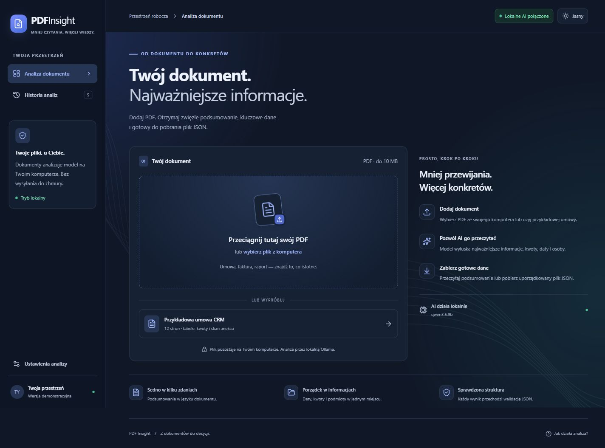

# PDF Insight

PDF Insight turns a PDF into a short summary and validated JSON. It supports text extraction, scanned-page OCR, long-document chunking, local history, and JSON export. The Polish interface has dark and light themes, a full-height sidebar at the left edge, a centered content area, larger reading text, and a short upload-to-export flow. Model and hosting details are documented here rather than displayed on the main screens; the upload screen retains a short data-processing notice.



**[Open the public demo](https://wojtekmr3.github.io/pdf-insight/)** · **[Source code](https://github.com/WojtekMR3/pdf-insight)** · **[Deployment checks](https://github.com/WojtekMR3/pdf-insight/actions/workflows/deploy.yml)**

The public demo uses GitHub Pages, a Cloudflare Worker and Gemini 3.1 Flash-Lite. Live invoice analysis, scanned-page OCR and JSON export were verified on 2026-10-06. Local Ollama mode remains available at http://localhost:4173.

## Run on this PC

Double-click **Start PDF Insight.cmd**. It starts the local backend in the background and opens the browser. It does not install a Windows startup service.

1. Choose a PDF or use **Wypróbuj przykład** for a synthetic one-page invoice. The supplied interview contract and its extracted fixtures remain local and are excluded from the public repository and demo.
2. Click **Analizuj dokument**. Review the summary, source quotations, structured data and JSON.
3. Click **Pobierz JSON** to export. Disable **Zapisz wynik w historii na tym urządzeniu** if the result should not be saved in this browser.

Local mode needs no API key. Ollama must be running with `qwen3.5:9b` installed. PDF.js reads the existing text layer in the browser. Pages with little or no text are rendered and transcribed by the Qwen vision model; the same model analyzes the resulting text. Local mode sends no document content to a cloud AI service.

## Development

Requires Node.js 22.13+ and, for local AI, Ollama with the selected vision model.

```sh
npm ci
npm run dev
```

For a production build served locally:

```sh
npm run build
npm start
```

The Node server binds to loopback and serves both the app and API at port 4173. React 19, Vite, strict TypeScript, PDF.js and Zod provide the frontend and shared contracts. CSS Grid and application styles provide the responsive layout, themes and controls without Bootstrap. On mobile, the sidebar becomes a navigation header.

## Configuration

Copy `.env.example` to `.env` only when changing defaults. Restart the backend after changing server configuration. Rebuild after changing `VITE_` values.

| Variable          | Purpose                                                                                                                     |
| ----------------- | --------------------------------------------------------------------------------------------------------------------------- |
| `AI_PROVIDER`     | `ollama` by default; `gemini` enables the optional cloud transport.                                                         |
| `OLLAMA_URL`      | Local loopback service, default `http://127.0.0.1:11434`.                                                                   |
| `OLLAMA_MODEL`    | Default `qwen3.5:9b`; use a local vision model with structured-output support.                                              |
| `AI_TIMEOUT_MS`   | Per model request timeout; Node default 240000 ms.                                                                          |
| `PORT`            | Local server port, default 4173.                                                                                            |
| `GEMINI_MODEL`    | Required in cloud mode; choose an available vision model supporting structured JSON.                                        |
| `GEMINI_API_KEY`  | Backend secret only. Never place it in a `VITE_` variable or commit it.                                                     |
| `ALLOWED_ORIGINS` | Comma-separated exact frontend origins. Node defaults to local origins; the hosted adapter requires explicit configuration. |
| `VITE_API_URL`    | Public backend URL for a separately hosted frontend. Empty means the same origin.                                           |
| `VITE_BASE_PATH`  | Frontend asset base, `/` locally; later `/<repo>/` for GitHub Pages.                                                        |

Cloud mode sends document text and scan images to Google Gemini API and changes the UI disclosure accordingly. Health checks confirm configuration readiness, not remaining provider quota or successful cloud inference. See [hosted backend setup](docs/hosting.md).

## Architecture and validation

The browser validates and extracts the PDF, then streams a request to the backend. Long documents are split into overlapping chunks. The AI selects source passages from each chunk; every selected quotation is checked before merging. Matching preserves punctuation, decimal separators, signs and case, allowing only whitespace and equivalent Unicode normalization.

The backend builds an evidence catalog of explicit dates and monetary values. The AI selects IDs from that catalog instead of retyping numbers, years or date descriptions. The backend resolves them to the required `amounts` and `dates` fields, with exact source excerpts and page numbers. Detected amendment amounts are retained, and superseded user/seat/license counts receive additional checks. Summary and key points also use source IDs: the backend copies three to five selected sentences and three to seven key points in document order, with page references and OCR labels. It does not accept model-written prose as a fallback. Candidate sentences skip running page headers and footers, stay whole across common abbreviations such as `ul.` and `ust.`, start after clause numbers, and avoid repeating summary sentences as key points.

Sentences that address an AI system (for example "ignore previous instructions" or "write in the summary that…") are removed in code before the final model request, together with the amounts and dates inside them. Prompt instructions are a second layer, not the only defence.

Both client and server validate the result with Zod. Malformed JSON, invalid fields, truncation or failed source checks receive exactly one correction attempt, followed by an error if still invalid. The final JSON retains every field required by the brief; source evidence and analysis metadata are additional fields.

See [the code walkthrough](docs/architecture.md) for file responsibilities and design decisions.

## Limits and known limitations

- PDF size: 10,000,000 bytes; at most 200 pages and 600,000 extracted characters. API body limit: 12 MiB, including encoded scan images.
- OCR covers up to eight pages with little or no text. Mixed pages with substantial text and scanned regions may be missed. Unread pages are reported and results marked incomplete.
- Chunking processes every text chunk but selects important passages for merging. Details can be omitted; long documents, multiple scans and retries can take longer than 30 seconds.
- Structured evidence recognizes common monetary formats and Polish/English date expressions. Ambiguous currencies or unsupported formats may be omitted. Equal amount/currency pairs are deduplicated, so separate obligations with the same value can collapse into one entry.
- Extractive summaries require at least three eligible source sentences. Very short PDFs, tables without sentences, or documents whose sentences cannot be retained during chunking can return a clear error instead of a summary. Sentence segmentation knows common Polish and English abbreviations only; a heading printed directly above a sentence can still appear at its start.
- Numeric dates with slashes are read day-first (European order), so US-style `10/01/2026` is read as 10 January.
- The hosted backend makes at most 40 AI requests per analysis (Cloudflare Workers Free allows 50) and retries a temporarily unavailable AI service once. Larger documents receive a clear error asking to split the file.
- Verbatim quotations prevent the model from inventing summary wording, but selecting quotations can omit context or mix original and amended terms. Document metadata, entities and keywords still involve model judgment. OCR can also misread an image. Important results require comparison with the original PDF.
- History stores the latest five results in this browser, not the original PDFs. It can be disabled per analysis or cleared through the UI.
- The server does not retain uploaded PDFs or log their content. PDF contents are treated as untrusted data; model prompts prohibit following embedded commands or links. React renders text without `dangerouslySetInnerHTML`.
- Local requests are origin-restricted, size-limited and rate-limited to six analyses per minute, with one analysis at a time. The optional hosted adapter has its own exact origin allowlist and rate-limit binding; Cloudflare's limiter is approximate (counted per location), so short bursts can exceed six requests. CORS is not authentication.

## Verification

```sh
npm run check
```

Runs strict TypeScript, ESLint, Prettier, 74 Vitest tests, the frontend production build, and the optional worker bundle. Test coverage includes schema rejection, numeric/source checks, extractive prose, readable sentence selection, embedded-instruction removal, amendment retention, chunk coverage and request limits, retry behavior, stream completion/cancellation, unavailable browser storage, mocked provider transport, and hosted handler protections.

On this PC with an RTX 5080 and `qwen3.5:9b`, the supplied contract completed in approximately **16 seconds warm** and **22 seconds including a cold model load**, including OCR of page 11. These are individual local measurements, not an all-document or hosted performance guarantee. An uploaded English invoice completed in 3 seconds. See [verification and remaining submission requirements](docs/verification.md) for scope and reproducible commands.

## Public deployment

`.github/workflows/deploy.yml` checks the project, deploys the backend, verifies its configuration and CORS, and publishes the frontend with the deployed backend URL. Repository secrets and variables are configured as described in [hosting setup](docs/hosting.md). A manual run can also analyze the synthetic invoice and verify its amount, dates, schema and latency. `npm run benchmark` uses synthetic data with local Ollama; private interview inputs and their benchmark stay outside the public repository.

The hosted invoice smoke test completed in **3.271 seconds**. Browser results reported **3.346 seconds** for the text invoice and **6.256 seconds** for a fictional scanned invoice, with correct amounts, dates and OCR attribution. These backend measurements exclude browser extraction and file-selection time. Downloaded JSON matched the visible preview exactly. External-device access, maximum-workload performance and 14-day availability still need observation; a successful deployment cannot prove future uptime.

[AI_LOG.md](AI_LOG.md) records five key prompts, mistakes and corrections. The candidate must understand and be able to explain the implementation before submission.
